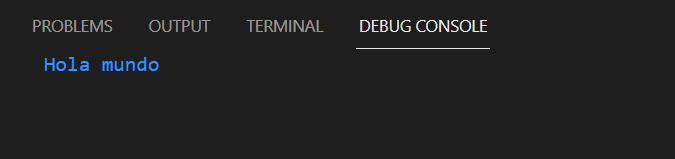

# Aprende un lenguaje de programación en un día (ejercicio voluntario para subir nota).

## Introducción

Cuando te sacaste el carnet de conducir, aprendiste las normas de circulación así como los fundamentos básicos para manejar un coche: volante, marchas, freno, acelerador, embrague, retrovisores... Seguramente, el coche que conduces ahora es diferente al que utilizaste para aprender a conducir, no obstante, lo puedes llevar sin problema. Cada coche tiene sus peculiaridades, pero quien sabe manejar un automóvil, puede adaptarse a las medidas, tacto y comportamiento de un vehículo en cuestión de horas.

Aprender a programar es como aprender a conducir. Si tienes una base sólida de programación y sabes manejar con soltura los tipos de datos, bucles, arrays, clases, métodos, etc. podrás pasar de un lenguaje a otro en un período relativamente corto, simplemente tendrás que adaptarte a la sintaxis y a las peculiaridades del nuevo lenguaje.

Con este ejercicio se pretende despertar el interés por otros lenguajes de programación distintos al que el alumno está estudiando como primer lenguaje.

Sigue los pasos que se indican a continuación.

## Creación del equipo

Este ejercicio se debe hacer en grupos de 3 alumnos. Uno de ellos será el representante del grupo.

## Forkea forkea

El representante del grupo debe hacer un *fork* de este repositorio para utilizarlo como base.

## Añadiendo colaboradores

El encargado del grupo deberá añadir como colaboradores del repositorio *forkeado* a los otros dos miembros, para trabajar todos sobre los mismos archivos. Cuando alguien es colaborador en un repositorio, puede hacer *push* a él sin necesidad de pedir permiso o hacer *pull request*.

Para añadir colaboradores hay que hacer click en la pestaña *Settings* y seleccionar luego *Collaborators* en el menú.

## Miembros del grupo

Escribe aquí los miembros del grupo. El primero es el representante o encargado.

* David Antúnez Pérez
* Sergio Morales García
* Francisco Sicilia Pérez
* Alberto Parra Toval

## Lenguaje de programación

El profesor llevará una cajita llena de papelitos con los nombres de distintos lenguajes de programación. Los encargados de cada grupo meterán la mano en la caja y sacarán dos papelitos, de los cuales el grupo elegirá uno. No se permite hacer intercambio de papelitos entre grupos.

Escribe el lenguaje de programación elegido por el grupo.

* Scala

Los papelitos se han recortado de este [documento](lenguajes_de_programacion.pdf).

## Información sobre el lenguaje


Scala es un lenguaje de programación multi-paradigma, creado en 2003 por Martin Odersky un informático alemán y profesor de métodos de programación en la École Polytechnique Fédérale de Lausanne en Suiza. Este programa fue diseñado para expresar patrones comunes de programación en forma concisa, elegante y con tipos seguros. Integra sutilmente características de lenguajes funcionales y orientados a objetos. La implementación actual se ejecuta en la máquina virtual de Java y es compatible con las aplicaciones Java existentes.

Las principales ventajas de este lenguaje de programación son:
Orientado a objetos → Scala es un lenguaje de programación puro orientado a objetos, en el sentido de que cada valor es un objeto. El tipo y comportamiento de los objetos se describe por medio de clases y traits. La abstracción de clases se realiza extendiendo otras clases y usando un mecanismo de composición basado en mixins como un reemplazo limpio de la herencia múltiple.

Lenguaje funcional → Scala también posee características propias de los lenguajes funcionales. En Scala las funciones son valores de primera clase, soportando funciones anónimas, orden superior, funciones anidadas y currificación. Scala viene integrado de fábrica con la técnica de pattern matching para modelar tipos algebraicos usados en muchos lenguajes funcionales.

Tipificado estático → Scala está equipado con un sistema de tipos expresivo que refuerza a que las abstracciones de tipos se usen en forma coherente y segura.

Escalable → Uno de los objetivos de Scala es tener un lenguaje que puede crecer y escalar con la demanda. Scala es adecuado para utilizar como un lenguaje de script o para realizar aplicaciones empresariales. La abstracción de componentes, la sintaxis sucinta, y el soporte para los paradigmas de orientación a objetos y funcional, hacen al lenguaje escalable.

Extensibilidad → Scala se diseñó teniendo en mente el hecho de que en la práctica el desarrollo de aplicaciones requiere a menudo de extensiones específicas del lenguaje. Para ello, Scala proporciona una combinación única de mecanismos que hacen fácil y sin problemas agregar construcciones nuevas al lenguaje en forma de bibliotecas.

Productividad → Gracias a su sistema de inferencia de tipos y otras características, Scala es un lenguaje conciso, dando la posibilidad a los desarrolladores de reducir el tamaño de código fuente por un factor de 2 o 3 comparado con Java.

Interoperabilidad con Java → Scala es compilado directamente a Java bytecode, corriendo en la Java Virtual Machine, aprovechando el poder y la madurez de la JVM, su colector de basura y las bien entendidas técnicas de despliegue. Al aprovechar esto, apenas hay incidencia en la marcha del proyecto. Las operaciones de equipo no verán la diferencia. Los desarrolladores seguirán trabajando con sus herramientas, pero escribiendo código más corto, más rápido, más escalable, más correcto.

Salidas Profesionales → Aprender Scala ofrece un abanico amplio de opciones de trabajo, pudiendo optar por el mundo Big Data, alistarte en el ejército backend donde puedes procesar millones de datos, o trabajando en sistemas.

Links a Manuales de Scala

Manual: https://www.scala-lang.org/docu/files/ScalaTutorial-es_ES.pdf
https://www.clubdetecnologia.net/blog/2015/que-es-scala/

Página oficial: https://www.scala-lang.org/


## Herramientas de desarrollo

Indica aquí qué software has tenido que instalar para programar en este lenguaje. Añade enlaces y/o capturas de pantalla.

Para instalar este lenguaje hemos tenido que instalar varias extensiones en VSCode llamadas Scala(Metals) y Scala Syntax(official) , también, desde la página web oficial de Scala hemos tenido que instalar [SBT](https://www.scala-lang.org/download/scala3.html) y JDK 11

## Poniendo en práctica el lenguaje

Pon en práctica el lenguaje de programación realizando los siguientes ejercicios. Para cada uno de los ejercicios, pega el código fuente de la solución y una captura de pantalla.

### 1. ¡Hola mundo!

Realiza un programa que muestre por pantalla la frase **¡Hola mundo!**.

**Código del programa:** 

```scala
object main extends App {
   println("Hola mundo")
 }
```

**Output:**



### 2. Pirámide

**Código del programa**

```scala
import scala.io.StdIn.readLine
object Main extends App{
    var alturaIntroducida :Int = 10
    println("Introduzca la altura de la pirámide: ")
    var planta :Int = 1
    var longitudDeLinea :Int = 1
    var espacios :Int = alturaIntroducida - 1;
    while(planta <= alturaIntroducida){
        // inserta espacios
        for( i <- 0 until espacios ){
            print(" ")
        }
        // pinta la linea
        for( j <- 0 until longitudDeLinea ){
            print("*")
        }
        println()
        planta = planta + 1
        espacios = espacios -1
        longitudDeLinea = longitudDeLinea + 2
    }
}
```


Dada una altura introducida por el usuario, realiza un programa que pinte una pirámide a base de asteriscos con la altura indicada.

### 3. Arrays y números aleatorios

Realiza un programa que rellene un array (o una estructura similar) con 20 números enteros aleatorios entre 1 y 100 y que seguidamente los muestre por pantalla. A continuación, se deben pasar los números primos a las primeras posiciones del array y los no primos a las posiciones restantes. Muestra finalmente el array resultado.

**Código del programa:** 

```scala
import Array._

object main {
  def n_rands(n: Int) = {
    val r = new scala.util.Random
    1 to n map { _ => r.nextInt(200) }
    for (x <- 1 until 20) {
      println(r)
    }
  }
}
```

## Presentación de resultados

Cada equipo explicará al resto de la clase lo aprendido durante la realización del ejercicio. Todos los miembros de cada equipo deben participar en la explicación. Se puede utilizar como material de base para la presentación el repositorio de GitHub.

## Recompensa

* Todos los alumnos que realicen correctamente la actividad tendrán 0'25 puntos extra en la nota del trimestre.

* Los miembros del equipo más votado ganarán un premio.

:star: Si te ha gustado este ejercicio, dale una estrellita al [repositorio original](https://github.com/LuisJoseSanchez/aprende-un-lenguaje-en-un-dia).

